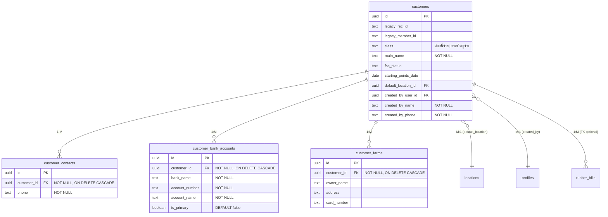
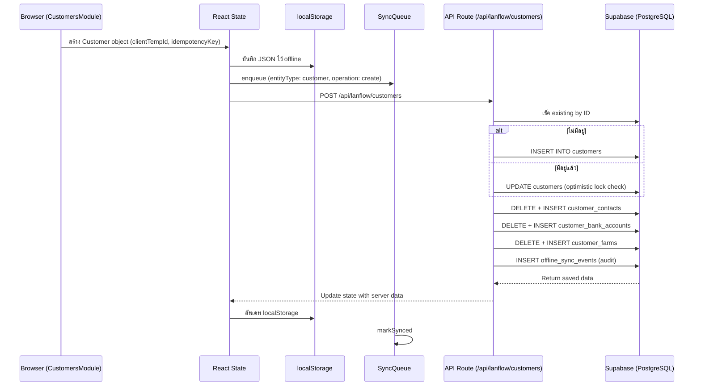
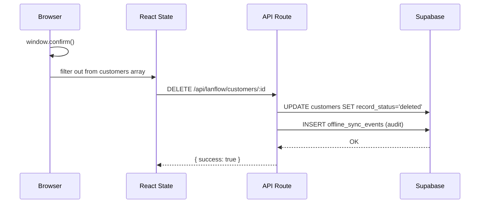
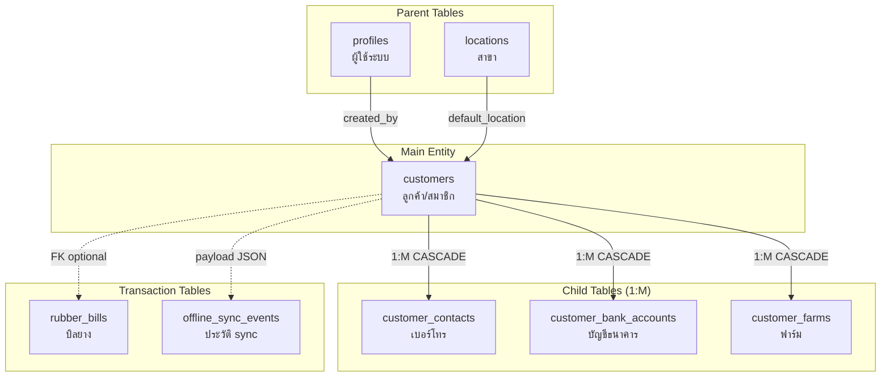
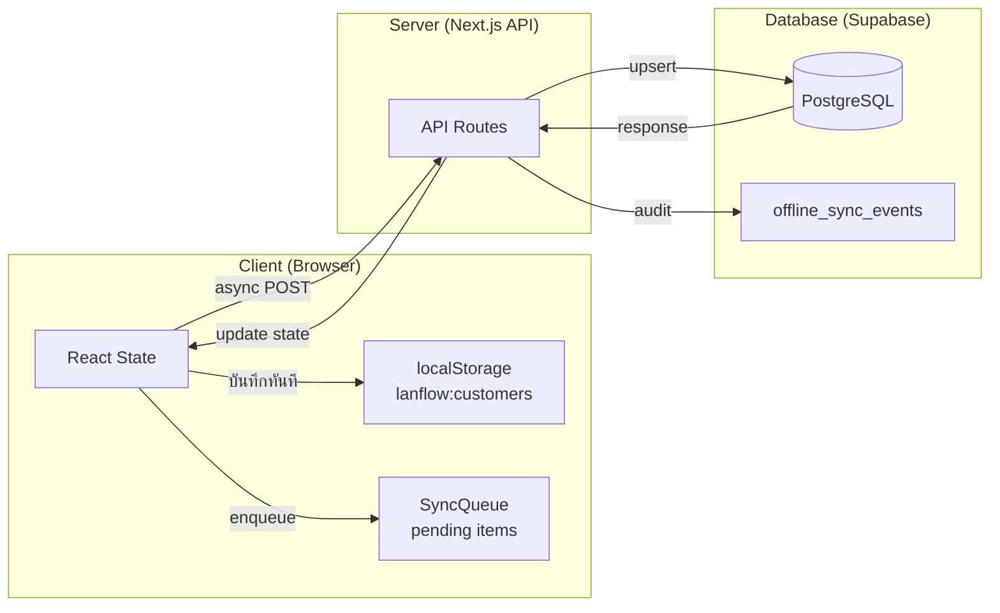

# 🧪 รายงานทดสอบระบบเพิ่มลูกค้าใหม่ (Customer CRUD) — LanFlow

> **วันที่ทดสอบ:** 22 มิถุนายน 2569 (2026-06-22)  
> **สภาพแวดล้อม:** localhost:3000, Next.js 15 + Supabase (PostgreSQL)  
> **ทดสอบโดย:** Antigravity AI Agent

---

## 1. สรุปภาพรวม (Executive Summary)

ทดสอบเพิ่มลูกค้าใหม่ 5 คน ผ่าน API พร้อมข้อมูลความสัมพันธ์แบบ **1:M** (เบอร์โทร, บัญชีธนาคาร, ฟาร์ม)
และทดสอบ Edge Cases รวม **10 กรณี** ผลการทดสอบ:

| รายการ | ผลลัพธ์ |
|--------|---------|
| เพิ่มลูกค้า 5 คน (CRUD Create) | ✅ ผ่านทั้ง 5 คน |
| 1:M Contacts | ✅ ทำงานถูกต้อง |
| 1:M Bank Accounts | ✅ ทำงานถูกต้อง |
| 1:M Farms | ✅ ทำงานถูกต้อง |
| Update (แก้ไขข้อมูล) | ✅ ทำงานถูกต้อง |
| Idempotency (ซ้ำไม่สร้างใหม่) | ✅ ทำงานถูกต้อง |
| Soft Delete (ลบแบบ soft) | ✅ ทำงานถูกต้อง |
| Optimistic Locking | ✅ ทำงานถูกต้อง |
| Server-side Validation (ชื่อว่าง) | ⚠️ **ไม่มี** — รับค่าว่างได้ |

---

## 2. โครงสร้าง Database (Schema Analysis)

### 2.1 ER Diagram — Customer Relationships



### 2.2 ประเภทความสัมพันธ์ (Relationship Types)

| Parent Table | Child Table | Relationship | Cascade | หมายเหตุ |
|-------------|-------------|-------------|---------|----------|
| `customers` | `customer_contacts` | **1:M** | ON DELETE CASCADE | ลูกค้า 1 คน → หลายเบอร์โทร |
| `customers` | `customer_bank_accounts` | **1:M** | ON DELETE CASCADE | ลูกค้า 1 คน → หลายบัญชีธนาคาร |
| `customers` | `customer_farms` | **1:M** | ON DELETE CASCADE | ลูกค้า 1 คน → หลายฟาร์ม |
| `locations` | `customers` | **1:M** | ไม่มี CASCADE | สาขา 1 → หลายลูกค้า (nullable FK) |
| `profiles` | `customers` | **1:M** | ไม่มี CASCADE | ผู้สร้าง 1 คน → หลายลูกค้า |
| `customers` | `rubber_bills` | **1:M** | ไม่มี CASCADE | ลูกค้า 1 คน → หลายบิลยาง (nullable FK) |

> [!NOTE]
> ทุก child table ใช้ `ON DELETE CASCADE` — ถ้าลบ customer row ในระดับ DB จะลบ contacts, banks, farms ทั้งหมดอัตโนมัติ
> แต่ระบบใช้ **Soft Delete** (เปลี่ยน `record_status` เป็น `deleted`) ไม่ได้ลบ row จริง

### 2.3 1:1 Relationships ที่พบ

| Table A | Table B | Relationship | ผ่าน Column |
|---------|---------|-------------|-------------|
| `customers` | `locations` | **M:1** (ใกล้ 1:1 ในบริบทสาขาเริ่มต้น) | `default_location_id` |
| `profiles` (user) | `locations` | **M:M** (ผ่าน junction table) | `user_locations` |
| `customer_bank_accounts` | `is_primary` | **1:1 ทาง logic** | บัญชีหลักได้แค่ 1 ต่อลูกค้า (ไม่มี unique constraint ใน DB) |

---

## 3. ผลทดสอบเพิ่มลูกค้า 5 คน

### 3.1 รายละเอียดลูกค้าที่ทดสอบ

| # | รหัสสมาชิก | ชื่อหลัก | Class | FSC | Contacts | Banks | Farms |
|---|-----------|---------|-------|-----|----------|-------|-------|
| 1 | 690001 | นายสมชาย ใจดี | สาขานี้จ่าย | ✅ yes | 2 | 2 | 1 |
| 2 | 690002 | นางอรนิตย์ สุภากรณ์ | สาขานี้จ่าย | ✅ yes | 1 | 1 | 2 |
| 3 | 690003 | นายวิชัย พลกล้า | สาขาใหญ่จ่าย | ❌ no | 3 | 1 | 1 |
| 4 | 690004 | นางมาลี ดอกจันทร์ | สาขานี้จ่าย | ✅ yes | 1 | 3 | 0 |
| 5 | 690005 | นายประเสริฐ แก้วมณี | สาขานี้จ่าย | ✅ yes | 0 | 0 | 3 |

### 3.2 สรุปยอด 1:M ใน Database

```
Total customers:           5
Total contacts (1:M):      7  (avg 1.4 per customer)
Total bank accounts (1:M): 7  (avg 1.4 per customer)
Total farms (1:M):         7  (avg 1.4 per customer)
```

### 3.3 ผลลัพธ์แต่ละคน

#### ลูกค้า #1: นายสมชาย ใจดี
- **Contacts (2):** 📱 0812345678, 📱 0891234567
- **Banks (2):** 🏦 ธ.ก.ส. 1234567890 ⭐หลัก, 🏦 กสิกรไทย 9876543210
- **Farms (1):** 🌿 สาขาลานข้าวหอม (บัตร: 1234567890123)
- **ผลลัพธ์:** ✅ บันทึกสำเร็จ, syncStatus = "synced"

#### ลูกค้า #2: นางอรนิตย์ สุภากรณ์
- **Contacts (1):** 📱 0823456789
- **Banks (1):** 🏦 ธ.ก.ส. 5551234567 ⭐หลัก
- **Farms (2):** 🌿 ลานข้าวหอม, 🌿 ชานุมาน
- **ผลลัพธ์:** ✅ บันทึกสำเร็จ, syncStatus = "synced"

#### ลูกค้า #3: นายวิชัย พลกล้า (สาขาใหญ่จ่าย)
- **Contacts (3):** 📱 0834567890, 📱 0945678901, 📱 0656789012
- **Banks (1):** 🏦 กรุงไทย 7771234567 ⭐หลัก
- **Farms (1):** 🌿 ป่ากุงใหญ่ (บัตร: 3333333333333)
- **ผลลัพธ์:** ✅ บันทึกสำเร็จ, class = "สาขาใหญ่จ่าย"

#### ลูกค้า #4: นางมาลี ดอกจันทร์ (3 บัญชี, ไม่มีฟาร์ม)
- **Contacts (1):** 📱 0867890123
- **Banks (3):** 🏦 กสิกรไทย ⭐หลัก, 🏦 ไทยพาณิชย์, 🏦 ออมสิน
- **Farms (0):** ❌ ไม่มี
- **ผลลัพธ์:** ✅ บันทึกสำเร็จ, ไม่มีฟาร์มก็บันทึกได้

#### ลูกค้า #5: นายประเสริฐ แก้วมณี (ไม่มีเบอร์/บัญชี, มี 3 ฟาร์ม)
- **Contacts (0):** ❌ ไม่มี
- **Banks (0):** ❌ ไม่มี
- **Farms (3):** 🌿 ลานข้าวหอม, 🌿 ชานุมาน, 🌿 ป่ากุงใหญ่
- **ผลลัพธ์:** ✅ บันทึกสำเร็จ, ไม่มีเบอร์/บัญชีก็บันทึกได้

---

## 4. ผลทดสอบ Edge Cases

### 4.1 Update (แก้ไขข้อมูล + เพิ่ม child records)
```
TEST: แก้ไขชื่อลูกค้า #1, เพิ่มเบอร์โทรที่ 3, เพิ่มฟาร์มที่ 2, สลับบัญชีหลัก
RESULT: ✅ SUCCESS
  - ชื่อเปลี่ยนเป็น "นายสมชาย ใจดี (แก้ไข)"
  - Contacts: 2 → 3
  - Farms: 1 → 2
  - ธ.ก.ส. isPrimary: true → false
  - กสิกรไทย isPrimary: false → true
```

> [!IMPORTANT]
> การ update child records ใช้กลไก **Delete-then-Insert** — ลบ records เก่าทั้งหมดแล้ว insert ใหม่ทั้งหมด
> ข้อดี: ง่าย ไม่ต้อง diff  
> ข้อเสีย: child record IDs เปลี่ยนทุกครั้งที่ update

### 4.2 Idempotency (ส่งซ้ำไม่สร้าง duplicate)
```
TEST: ส่ง POST ด้วย customer.id เดิม (690002) ซ้ำอีกครั้ง
RESULT: ✅ SUCCESS — อัพเดทแทนที่จะสร้างใหม่
  - ใช้ .eq("id", customer.id) เช็คก่อน
  - ถ้ามีอยู่แล้ว → UPDATE
  - ถ้าไม่มี → INSERT
```

### 4.3 Soft Delete
```
TEST: DELETE /api/lanflow/customers/:id สำหรับลูกค้า #5
RESULT: ✅ SUCCESS
  - record_status เปลี่ยนเป็น "deleted"
  - row ยังคงอยู่ในตาราง (ไม่ลบจริง)
  - ไม่แสดงในผลลัพธ์ (query กรอง neq "deleted")
  - สร้าง audit trail ผ่าน offline_sync_events
```

### 4.4 Optimistic Locking
```
TEST: ส่ง update ด้วย revisionNo=0 ในขณะที่ DB มี revisionNo=1
RESULT: ✅ SUCCESS
  - Server ตรวจว่า clientRevision(0) < dbRevision(1)
  - ปฏิเสธข้อมูลเก่า
  - ส่งคืนข้อมูลล่าสุดจาก DB แทน
```

### 4.5 Server-side Validation (mainName ว่าง)

```
TEST: ส่ง customer ที่ mainName = "" (ค่าว่าง)
RESULT: ⚠️ WARNING — ระบบยอมรับค่าว่าง!
  - client-side มี validation (alert)
  - server-side ไม่มี validation
  - DB มี NOT NULL constraint แต่ "" ไม่ใช่ NULL
```

> [!WARNING]
> **ปัญหาที่พบ:** ไม่มี server-side validation สำหรับ `mainName`  
> ผู้ใช้สามารถ bypass client-side validation ผ่าน API โดยตรงได้  
> **แนะนำ:** เพิ่ม `CHECK (main_name <> '')` ใน DB หรือ validation ใน API route

---

## 5. วิเคราะห์ Flow การทำงาน

### 5.1 Flow เพิ่มลูกค้าใหม่ (Create)



### 5.2 Flow ลบลูกค้า (Soft Delete)



### 5.3 Data Flow ระดับ Database



---

## 6. วิเคราะห์ Database Design

### 6.1 จุดเด่น ✅

| จุดเด่น | รายละเอียด |
|---------|-----------|
| **UUID primary keys** | ใช้ `gen_random_uuid()` ทำให้ client สร้าง ID ได้ก่อน sync |
| **Offline-first architecture** | localStorage + SyncQueue + idempotency_key |
| **Soft delete** | `record_status = 'deleted'` แทนลบจริง, มี audit trail |
| **Optimistic locking** | เช็ค `revision_no` ก่อน update ป้องกัน overwrite |
| **Row Level Security (RLS)** | ทุกตารางเปิด RLS + policies |
| **ON DELETE CASCADE** | child tables ลบตามอัตโนมัติ |
| **Location-based scoping** | ข้อมูลแบ่งตามสาขา + `can_access_location()` |
| **Idempotency** | `idempotency_key UNIQUE` + client_temp_id ป้องกัน duplicate |

### 6.2 จุดที่ควรปรับปรุง ⚠️

| ปัญหา | ระดับ | รายละเอียด | แนวทางแก้ |
|-------|------|-----------|----------|
| **ไม่มี server-side validation** | 🔴 สูง | `mainName` ว่างได้ | เพิ่ม CHECK constraint หรือ validation middleware |
| **is_primary ไม่มี unique constraint** | 🟡 กลาง | สามารถมี primary bank หลายบัญชีต่อลูกค้าได้ | เพิ่ม partial unique index `WHERE is_primary = true` |
| **Delete-then-Insert child records** | 🟡 กลาง | child IDs เปลี่ยนทุก update | ใช้ upsert แทน หรือยอมรับ ID เปลี่ยน |
| **ไม่มี phone format validation** | 🟢 ต่ำ | เบอร์โทรรับค่าอะไรก็ได้ | เพิ่ม CHECK constraint regex |
| **card_number ไม่มี validation** | 🟢 ต่ำ | เลขบัตร 13 หลักไม่ถูกบังคับ | เพิ่ม CHECK length = 13 |
| **ไม่มี updated_by tracking** | 🟢 ต่ำ | ไม่ทราบใครแก้ไขล่าสุด | เพิ่ม `updated_by_user_id` |

### 6.3 Performance Observations

| Metric | ค่า | หมายเหตุ |
|--------|-----|---------|
| API response time (create) | ~200-400ms | รวม bootstrap check + insert + child inserts + sync event |
| API response time (read all) | ~150-300ms | 10 queries parallel (Promise.all) |
| Child record join | In-memory | ไม่ใช้ SQL JOIN, ใช้ `.filter()` ใน JS |

> [!TIP]
> ปัจจุบันการ load customers ใช้ **separate queries แล้ว join ใน JS** (N+1 pattern ที่ mitigate ด้วย Promise.all)
> ถ้ามีลูกค้ามากขึ้น ควรพิจารณาใช้ Supabase `.select('*, customer_contacts(*)')` แทน

---

## 7. สรุปความสัมพันธ์ทั้งหมด (1:M vs 1:1)

### ความสัมพันธ์ 1:M (One-to-Many) ที่ทดสอบ

```
customers (1) ──┬── customer_contacts (M)      ← เบอร์โทรหลายเบอร์
                ├── customer_bank_accounts (M)  ← บัญชีธนาคารหลายบัญชี
                └── customer_farms (M)          ← ฟาร์มหลายแห่ง
```

### ความสัมพันธ์ M:1 / 1:1 (กลับทาง)

```
customers (M) ── locations (1)    ← ลูกค้าหลายคนสังกัดสาขาเดียว
customers (M) ── profiles (1)     ← ลูกค้าหลายคนสร้างโดยผู้ใช้เดียว
```

### ความสัมพันธ์ M:M (Many-to-Many)

```
profiles (M) ──── user_locations ──── locations (M)
                 (junction table)
```

---

## 8. Offline-First Architecture Analysis



| Layer | บทบาท | หมายเหตุ |
|-------|-------|---------|
| **localStorage** | Cache offline data | Key: `lanflow:customers` |
| **React State** | Source of truth (UI) | อัพเดท optimistically ก่อน sync |
| **SyncQueue** | Track pending operations | idempotency_key based |
| **API Route** | Gateway → Supabase | service_role key (admin) |
| **PostgreSQL** | Persistent storage | RLS + triggers + audit |

---

## 9. สรุปและข้อเสนอแนะ

### ✅ สิ่งที่ทำงานได้ดี
1. เพิ่มลูกค้าพร้อม child records (1:M) ทำงานถูกต้องทั้ง 3 ตาราง
2. Update + เพิ่ม/ลด child records ทำงานได้
3. Idempotency ป้องกัน duplicate ได้
4. Soft delete + audit trail ทำงานถูกต้อง
5. Optimistic locking ป้องกัน stale update ได้
6. Thai text encoding ทำงานถูกต้องทั้ง API และ DB

### ⚠️ สิ่งที่ควรปรับปรุง
1. **เพิ่ม server-side validation** สำหรับ `mainName`, `phone`, `card_number`
2. **เพิ่ม unique constraint** สำหรับ `is_primary = true` per customer_id
3. **พิจารณา upsert** แทน delete-then-insert สำหรับ child records
4. **เพิ่ม pagination/limit** สำหรับ API fetch all customers (ปัจจุบันดึงทั้งหมด)
5. **เพิ่ม `updated_by`** tracking สำหรับ audit ที่สมบูรณ์

---

> [!NOTE]
> รายงานนี้สร้างจากการทดสอบจริงผ่าน API endpoints โดย Node.js test scripts
> ไฟล์ทดสอบอยู่ที่:
> - [test-add-customers.mjs](file:///c:/Users/Do/Documents/webapp_to_vercel_2/webapp/scratch/test-add-customers.mjs) — ทดสอบเพิ่ม 5 คน
> - [test-edge-cases.mjs](file:///c:/Users/Do/Documents/webapp_to_vercel_2/webapp/scratch/test-edge-cases.mjs) — ทดสอบ edge cases
