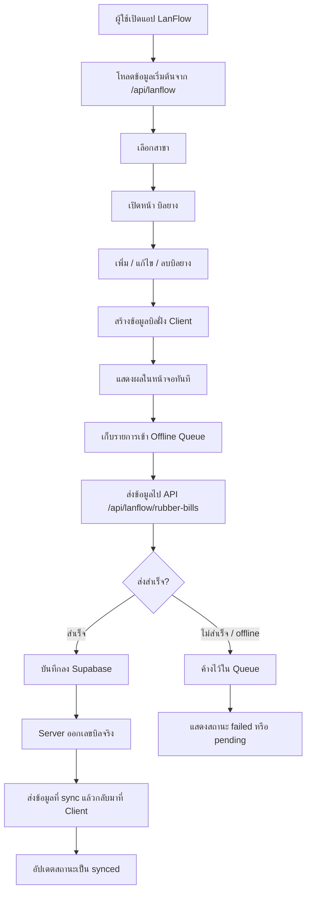
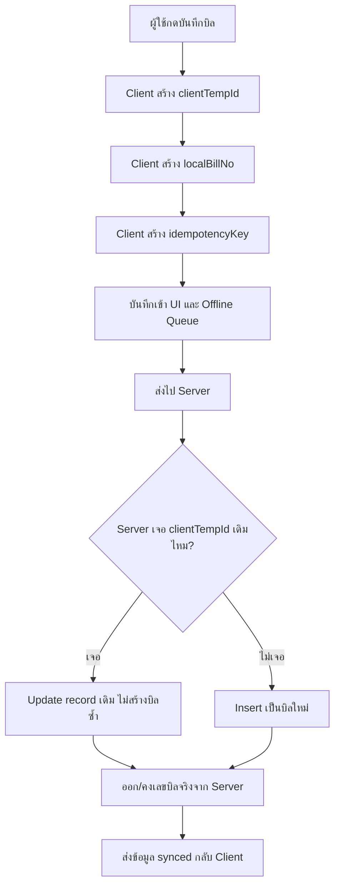

# Rubber Bill Data Flow Overview

เอกสารนี้สรุปภาพรวม flow ของข้อมูลหน้า `บิลยาง` ตั้งแต่ผู้ใช้กรอกข้อมูลใน PWA จนข้อมูลถูกบันทึกลง Supabase

## ภาพรวม Flow

## ลำดับข้อมูลแบบสั้น

1. ผู้ใช้เปิดแอป
2. แอปโหลดข้อมูลจาก Supabase ผ่าน API `/api/lanflow`
3. ผู้ใช้เลือกสาขาที่ต้องการทำงาน
4. ผู้ใช้เปิดหน้า `บิลยาง`
5. ผู้ใช้กรอกข้อมูลบิล เช่น ลูกค้า, วันที่, รายการชั่ง, รายการหัก, ผู้รับผิดชอบการจ่าย
6. ระบบสร้างข้อมูลชั่วคราวฝั่งเครื่อง เช่น `clientTempId`, `localBillNo`, `idempotencyKey`
7. ระบบเพิ่มบิลเข้า UI ทันที เพื่อให้ผู้ใช้เห็นข้อมูลโดยไม่ต้องรอ server
8. ระบบเก็บรายการไว้ใน `Offline Queue`
9. ระบบพยายามส่งข้อมูลไปที่ `/api/lanflow/rubber-bills`
10. API บันทึกข้อมูลลง Supabase
11. Supabase/Server ส่งข้อมูลกลับมาพร้อมเลขบิลจริงและสถานะ `synced`
12. ถ้าส่งไม่สำเร็จ รายการจะยังอยู่ใน queue เพื่อรอจัดการหรือ sync ใหม่

## ข้อมูลที่วิ่งผ่านระบบ

| จุด | ข้อมูลหลัก |
| --- | --- |
| Client/UI | ข้อมูลบิลที่ผู้ใช้กรอก |
| Local state | รายการบิลที่แสดงบนหน้าจอ |
| Offline Queue | payload ที่รอ sync |
| API Route | รับ payload จาก client |
| Supabase | เก็บข้อมูลจริงในฐานข้อมูล |
| Client หลัง sync | ได้เลขบิลจริงและสถานะล่าสุด |

## การป้องกันข้อมูลชนกัน

ระบบบิลยางถูกออกแบบให้ลดปัญหาข้อมูลชนกันเวลาหลายเครื่องบันทึกพร้อมกัน หรือเครื่องเดียวกันกดส่งซ้ำ โดยใช้ข้อมูลควบคุมหลายตัวร่วมกัน

| ตัวช่วย | ใช้ทำอะไร |
| --- | --- |
| `clientTempId` | รหัสชั่วคราวที่ client สร้างให้บิลแต่ละใบ ใช้ตามรอยบิลก่อนมี id จริงจาก Supabase |
| `localBillNo` | เลขบิลชั่วคราวที่แสดงให้ผู้ใช้เห็นทันทีตอนยังไม่ sync |
| `idempotencyKey` | กุญแจกันส่งซ้ำ เช่น create/update/delete รายการเดิม ไม่ควรถูกสร้างซ้ำเป็นหลายบิล |
| `clientRecordedAt` | เวลาที่เครื่องผู้ใช้กดบันทึก ใช้อ้างอิงลำดับเหตุการณ์ฝั่ง client |
| `serverReceivedAt` | เวลาที่ server รับข้อมูล ใช้อ้างอิงลำดับกลางหลัง sync |
| `revisionNo` | เลขรอบการแก้ไข ใช้แยก create, update, delete ของบิลเดียวกัน |
| `syncStatus` | บอกว่ารายการยังรอ sync, sync แล้ว, หรือส่งไม่สำเร็จ |
| `locationId` | ผูกข้อมูลกับสาขา ป้องกันข้อมูลข้ามสาขาปนกัน |

Flow ป้องกันข้อมูลซ้ำในปัจจุบันคือ เมื่อข้อมูลไปถึง server ระบบจะค้นหา `rubber_bills` จาก `client_temp_id` ก่อน ถ้าเจอ record เดิมจะ update record นั้น ถ้าไม่เจอจึง insert ใหม่ วิธีนี้ช่วยลดปัญหากดบันทึกซ้ำหรือ retry แล้วเกิดบิลซ้ำ

สำหรับการแก้ไขและลบ ระบบจะเพิ่ม `revisionNo` แล้วสร้าง `idempotencyKey` ใหม่ เช่น `update:<clientTempId>:<revisionNo>` หรือ `delete:<clientTempId>:<revisionNo>` เพื่อให้แต่ละรอบการเปลี่ยนแปลงของบิลเดียวกันมีตัวตนชัดเจน

ข้อจำกัดตอนนี้คือระบบยังไม่มี conflict resolution เต็มรูปแบบ ถ้ามีหลายเครื่องแก้บิลเดียวกันคนละเวลากัน ระบบยังควรเพิ่มการตรวจ `revisionNo` หรือ `updated_at` ฝั่ง server เพื่อบอกผู้ใช้ว่าข้อมูลชนกัน และให้เลือกว่าจะใช้ข้อมูลฝั่งเครื่องหรือฝั่ง server

## ตาราง Supabase ที่เกี่ยวข้อง

| ตาราง | บทบาท |
| --- | --- |
| `rubber_bills` | เก็บหัวบิลยาง |
| `rubber_bill_items` | เก็บรายการย่อยของบิล เช่น รายการชั่ง, หักน้ำกรด, หักหนี้ |
| `offline_sync_events` | เก็บประวัติการ sync |
| `locations` | เก็บข้อมูลสาขา |
| `profiles` | เก็บข้อมูลผู้ใช้ |

## สถานะของข้อมูล

| สถานะ | ความหมาย |
| --- | --- |
| `pending` | สร้างแล้ว รอ sync |
| `synced` | บันทึกลง Supabase สำเร็จแล้ว |
| `failed` | ส่งข้อมูลไม่สำเร็จ |
| `conflict` | เตรียมไว้สำหรับกรณีข้อมูลชนกัน |

## สรุป

Flow หลักของบิลยางคือ ผู้ใช้กรอกข้อมูลใน PWA -> ระบบสร้างเลขชั่วคราวและแสดงผลทันที -> เก็บลง Offline Queue -> ส่งเข้า API -> บันทึกลง Supabase -> รับเลขบิลจริงกลับมา -> อัปเดตสถานะเป็น `synced`
