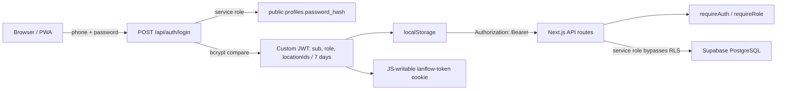
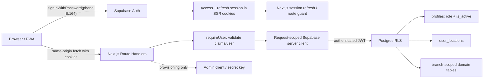

# Supabase Auth Migration Analysis and Runbook

วันที่วิเคราะห์: 2026-06-24

## Executive summary

LanFlow ควรย้ายไป Supabase Auth แต่การเปลี่ยนเฉพาะหน้า login หรือเปลี่ยน custom JWT เป็น Supabase JWT ยังไม่เพียงพอ

ปัญหาหลักของระบบปัจจุบันคือ API รับรองตัวตนด้วย custom JWT แล้วใช้ service role ทำ CRUD ทำให้ RLS ไม่ได้เป็น security boundary จริง และมีหลายเส้นทางที่ไม่ได้ตรวจ branch access

ข้อเสนอหลัก:

1. หยุดช่องโหว่เร่งด่วนก่อน cutover
2. ย้ายบัญชีเดิมโดยรักษา UUID และ bcrypt hash
3. ใช้ Supabase Auth session ผ่าน `@supabase/ssr`
4. เปลี่ยน domain data access เป็น user-scoped Supabase client
5. ซ่อม RLS helpers, grants และ policy coverage
6. รักษา offline queue แต่ re-authorize ทุก mutation ตอน sync
7. ลบ custom JWT และ `password_hash` หลัง rollback window

## Evidence reviewed

- `docs/authen.md`
- `docs/auth_architecture.md`
- `docs/implementation_plan.md`
- `src/lib/server/auth.ts`
- `src/hooks/use-auth.ts`
- `src/lib/auth-fetch.ts`
- `src/middleware.ts`
- `src/app/api/auth/*`
- `src/app/api/lanflow/*`
- `src/lib/server/lanflow-db.ts`
- Supabase schema, migrations, seed และ backup snapshots
- installed packages:
  - `@supabase/supabase-js@2.108.2`
  - `@supabase/auth-js@2.108.2`
  - `@supabase/ssr@0.6.1`

backup snapshots วันที่ 2026-06-23 มี Profile หนึ่งรายการและ UUID/phone ไม่ซ้ำ แต่ snapshot ไม่ใช่หลักฐานของ production ปัจจุบัน ต้องทำ production preflight ก่อน migration จริง

## Current-state model



## Documentation drift

`authen.md` อธิบายหลักการเดิมได้ถูกทิศ แต่ล้าสมัยในจุดสำคัญ:

- เอกสารบอก middleware เป็น future work แต่ `src/middleware.ts` มีแล้ว
- เอกสารบอก refresh เป็น future work แต่ `/api/auth/refresh` มีแล้ว
- `implementation_plan.md` ระบุ register เป็น admin-only แต่ route จริงเปิด public registration
- เอกสารบางจุดบอก API อ่าน token จาก header หรือ cookie แต่ `getTokenFromRequest()` อ่านเฉพาะ Authorization header
- เอกสารยังไม่ครอบคลุม modules ใหม่ เช่น OCR, transport staff และ money transfers

## Security and correctness findings

### P0: Admin user-list endpoint ตรวจผล auth ผิด

`src/app/api/lanflow/admin/users/route.ts` ใช้:

```ts
if (auth instanceof NextResponse) return auth;
```

แต่ `requireAuth()` คืน discriminated result `{ ok, auth/response }` ไม่ได้คืน `NextResponse` โดยตรง ทำให้ check ไม่หยุด request ที่ unauthenticated/unauthorized

ผลกระทบ: endpoint มีโอกาสเปิดเผยรายชื่อผู้ใช้ เบอร์โทร role และ location assignments โดยไม่ต้องล็อกอิน

แก้ทันทีด้วย pattern:

```ts
const auth = await requireAuth(request);
if (!auth.ok) return auth.response;
```

### P0: Main bootstrap endpoint ส่งข้อมูลข้ามสาขา

`GET /api/lanflow` เรียก `getLanFlowData(result.auth.sub)` แต่ `getLanFlowData()` ใช้ service role แล้ว query:

- locations ทั้งหมด
- rubber bills ทั้งหมด
- income/expense ทั้งหมด
- customers และ child tables ทั้งหมด

แม้ response profile จะมีเฉพาะ location assignments ของผู้ใช้ แต่ data arrays ไม่ได้ filter ตาม assignments

ผลกระทบ: ผู้ใช้ที่มี custom JWT ถูกต้องอาจดาวน์โหลดข้อมูลทุกสาขาได้

### P0: Branch authorization ไม่ได้บังคับก่อน write

ตัวอย่าง operation ที่รับ location หรือ record ID จาก client แล้วใช้ service role:

- save rubber bill
- save income/expense
- save/update/delete OCR ticket
- save/delete money transfer
- save/delete customer
- save/delete transport staff

หลายจุดไม่โหลด target record เพื่อตรวจ location และไม่เทียบกับ authorization context

ผลกระทบ: IDOR/cross-branch read-write-delete

### P0: Runtime bootstrap สร้าง privileged account/data

`ensureLanFlowBootstrap()` ถูกเรียกจาก domain data functions หลายตัว และสามารถสร้าง fixed super admin/profile/locations ใน request path

Migration วันที่ 2026-06-24 ยังตั้ง development password แบบ hard-coded ให้ super admin เมื่อ hash ว่าง

ผลกระทบ:

- production behavior ผูกกับ seed logic
- known development credential อาจกลายเป็น production credential
- request ปกติมี privileged side effect

ต้องย้าย bootstrap ไปเป็น explicit seed/dev-only operation และลบ credential ออกจาก migration

### P1: Public self-registration ไม่ตรงกับ business provisioning

หน้า login มีโหมดสมัครสมาชิก และ `/api/auth/register`:

- ไม่ require admin
- สร้าง role `user`
- เปิด `is_active=true`
- ใช้ password ขั้นต่ำ 4 ตัว
- ไม่มี branch assignment

แม้ผู้สมัครใหม่ยังไม่มี location แต่การที่ API บางส่วนไม่ enforce location ทำให้ assumption นี้ไม่ปลอดภัย

ข้อเสนอ: ปิด self-signup และให้ admin provision user + initial location ใน flow เดียว

### P1: Account deactivation และ privilege changes ไม่ immediate

`requireAuth()` ตรวจเพียงลายเซ็น/อายุ custom JWT ไม่ตรวจ:

- `profiles.is_active`
- role ล่าสุด
- location assignments ล่าสุด

`/api/auth/me` และ refresh อ่านข้อมูลใหม่ตอน mount แต่ token ที่กำลังใช้อยู่ยังมีสิทธิ์เดิมได้จนกว่าจะ refresh/reload/หมดอายุ

### P1: RLS helpers ยังไม่พร้อมใช้งานจริง

RLS functions ปัจจุบัน query ตารางที่มี RLS:

- `is_super_admin()` query `profiles`
- `can_access_location()` query `user_locations` และ `profiles`

functions ไม่ได้เป็น `SECURITY DEFINER` จึงเสี่ยง policy recursion เมื่อเปลี่ยนมาใช้ authenticated client

ต้อง harden function ownership, search path, execute grants และทดสอบ recursion ก่อน cutover

### P1: `authenticated` ไม่มี DML grants ที่จำเป็น

schema backup ให้ `authenticated` เพียง privileges บางชนิด เช่น references/trigger/truncate/maintain แต่ไม่พบ grant `SELECT/INSERT/UPDATE/DELETE` ที่ application ต้องใช้

RLS อย่างเดียวไม่ให้ table privilege ต้องเพิ่ม minimal grants แยกตาม table/operation

### P1: NULL location semantics เปิดข้อมูลเป็น global

policies หลายชุดใช้:

```sql
default_location_id is null
or can_access_location(default_location_id)
```

จึงถือ `NULL` ว่าทุกคนเข้าถึงได้

พบว่า `saveTransportStaff()` ไม่ได้เขียน `default_location_id` ลง row ทำให้ transport staff ที่สร้างผ่านโค้ดมีแนวโน้มเป็น global โดยอัตโนมัติ

ต้องตัดสินใจว่า NULL หมายถึง global อย่างตั้งใจ หรือเป็น invalid state ถ้า global ต้องมี explicit scope เช่น `visibility = 'global'` และจำกัดผู้สร้าง global record

### P1: Phone identity ยังไม่ canonical

ระบบรับรูปแบบ `08xxxxxxxx` และใช้ string ตรงๆ เป็น unique key

Supabase phone auth ใช้รูปแบบ E.164 เช่น `+66...` ต้องมี normalization เดียวทั้ง:

- migration
- login
- provisioning
- profile display/search

ควรเก็บ `phone_e164` เป็น canonical unique value และแยก display formatting

### P2: Token storage และ session lifecycle

custom JWT อยู่ใน localStorage และ cookie ที่ JavaScript เขียน/อ่านได้:

- ถูกขโมยได้เมื่อมี XSS
- cookie ไม่มี `Secure`
- cookie ไม่ใช่ server-managed session
- logout เป็น local clear ไม่มี server revocation

Supabase SSR แก้ session rotation และ server validation แต่ไม่ทำให้ XSS หายไป ต้องมี CSP และ frontend hardening เพิ่ม

### P2: Refresh implementation ไม่ตรง comment

`tryRefreshToken()` ถูกเรียกทุกครั้งหลัง `/me` สำเร็จ ไม่ได้ใช้ `isTokenExpiringSoon()` จึงออก custom JWT ใหม่ทุก online mount

### P2: Audit actor data บางส่วนเชื่อค่าจาก client

หลาย write function ใช้ `createdByName`, `createdByPhone`, `deletedByName`, `deletedByPhone` จาก payload หรือค่า default

actor ID มาจาก token แต่ชื่อ/เบอร์ใน audit trail อาจไม่ใช่ snapshot ที่เชื่อถือได้ ควร derive จาก profile ฝั่ง server/database

## Route risk matrix

| Route group | Auth ปัจจุบัน | Data client | Branch enforcement | Target |
|---|---|---|---|---|
| `/api/auth/login` | Public credential check | Service role | N/A | Supabase `signInWithPassword` |
| `/api/auth/register` | Public | Service role | ไม่มี | Admin provisioning only |
| `/api/auth/me` | Custom JWT | Service role | อ่าน assignments | Supabase session + profile query |
| `/api/lanflow` | Custom JWT | Service role | ไม่ filter data arrays | User-scoped + RLS |
| Rubber bills | Custom JWT | Service role | ไม่ตรวจ payload location | User-scoped + RLS |
| Income/expense | Custom JWT | Service role | ไม่ตรวจ payload location | User-scoped + RLS |
| Customers | Custom JWT | Service role | ไม่ enforce ใน API | User-scoped + explicit global rule |
| OCR tickets | Custom JWT | Service role | รับ location/ID จาก client | User-scoped + RLS |
| Money transfers | Custom JWT | Service role | GET filter location แต่ไม่ authorize location | User-scoped + RLS |
| Transport staff | Custom JWT | Service role | location ไม่ถูก persist | Fix model + user-scoped + RLS |
| Admin users list | Broken result check | Service role | N/A | Fix now; DB-backed admin RLS |
| Admin assignments | Role from stale JWT | Service role | admin จัดการได้ทุก location | Define scoped admin rule |

## Target-state architecture



## Recommended code shape

```text
src/lib/supabase/
  client.ts             Browser client
  server.ts             Cookie-backed server client
  middleware.ts         Refresh session and copy cookies

src/lib/server/
  auth-context.ts       requireUser / requireRole using Supabase session
  lanflow-db.ts         Accepts user-scoped client or request context
  supabase-admin.ts     Provisioning only
```

`lanflow-db.ts` ควรเปลี่ยนจาก:

```ts
const supabase = getAdminClient();
```

เป็น:

```ts
export async function saveRubberBill(
  supabase: UserScopedSupabaseClient,
  bill: RubberBill
) {
  // RLS supplies branch boundary
}
```

Route สร้าง client ภายใน request handler ทุกครั้ง ห้ามเก็บ user-specific client ใน module scope

## Database policy design

### Identity helper

```sql
create or replace function private.current_profile_id()
returns uuid
language sql
stable
security definer
set search_path = ''
as $$
  select auth.uid()
$$;
```

### Active user helper

```sql
create or replace function private.is_active_user()
returns boolean
language sql
stable
security definer
set search_path = ''
as $$
  select exists (
    select 1
    from public.profiles p
    where p.id = auth.uid()
      and p.is_active = true
  )
$$;
```

### Location helper

```sql
create or replace function private.can_access_location(target_location uuid)
returns boolean
language sql
stable
security definer
set search_path = ''
as $$
  select private.is_super_admin()
     or exists (
       select 1
       from public.user_locations ul
       join public.profiles p on p.id = ul.user_id
       where ul.user_id = auth.uid()
         and ul.location_id = target_location
         and p.is_active = true
     )
$$;
```

ต้องกำหนด owner/revoke/grant ให้ถูกต้องและทดสอบว่า helper ไม่เปิดช่อง privilege escalation

### Policy pattern

```sql
create policy "rubber bills select by location"
on public.rubber_bills
for select
to authenticated
using ((select private.can_access_location(location_id)));
```

สำหรับ update ต้องมีทั้ง `USING` และ `WITH CHECK` เพื่อกันย้าย record ไปสาขาอื่น

## Migration phases

### Phase 0: Immediate containment

ทำก่อนเริ่ม Supabase Auth migration:

1. แก้ auth result check ใน admin user-list route
2. ปิด public registration
3. ลบ known dev password ออกจาก migration และ rotate credential ที่อาจได้รับผล
4. ย้าย `ensureLanFlowBootstrap()` ออกจาก runtime request path
5. เพิ่ม explicit branch check ใน high-risk API เป็น temporary defense
6. เพิ่ม rate limit ให้ login ระหว่างที่ custom auth ยังทำงาน
7. ตรวจ logs ว่า admin users endpoint เคยถูกเรียกโดยไม่มี auth หรือไม่

Exit criteria:

- unauthenticated request เข้า admin/data routes ไม่ได้
- user สาขา A อ่าน/เขียน record สาขา B ไม่ได้ใน integration tests

### Phase 1: Data and identity preflight

1. Export profile count โดยไม่เปิดเผย password hash
2. ตรวจ:
   - duplicate phones หลัง E.164 normalization
   - duplicate/invalid UUID
   - NULL password hashes
   - inactive users
   - orphan `user_locations`
   - foreign keys ที่อ้าง profile ที่ไม่มีอยู่
3. กำหนด password policy ใหม่ อย่างน้อย 8 ตัว
4. เลือก recovery strategy
5. สำรอง auth/schema/data

ห้าม cutover ถ้ามี phone collision หรือ profile orphan ที่ยังไม่ได้ resolve

### Phase 2: Prepare RLS without changing login

1. สร้าง private security-definer helpers
2. เพิ่ม authenticated grants
3. แก้ policy recursion
4. เติม policy ให้ทุก module/operation
5. แก้ NULL location semantics
6. เพิ่ม location field ที่โค้ดไม่ persist
7. สร้าง RLS test suite โดยจำลอง user อย่างน้อย:
   - super admin
   - admin สาขา A
   - user สาขา A
   - user สาขา B
   - inactive user

Exit criteria:

- policy tests ผ่านทั้งหมด
- user A ไม่เห็น/แก้/ลบข้อมูล B
- inactive user ทำ operation ไม่ได้
- child tables ไม่รั่วผ่าน parent

### Phase 3: Import users to Supabase Auth

ใช้ one-off server script ที่ไม่ commit secrets และรองรับ dry-run

แนวคิด:

```ts
await admin.auth.admin.createUser({
  id: profile.id,
  email: phoneToAuthEmail(profile.phone),
  email_confirm: true,
  password_hash: profile.password_hash,
  user_metadata: { name: profile.name }
});
```

ข้อควรระวัง:

- `phone_confirm=true` เป็น business decision ไม่ใช่ default ที่ควรใช้ทั่วไป
- ถ้าเปิด phone confirmation ต้องมี SMS provider
- log เฉพาะ user ID/status ห้าม log hash
- script ต้อง idempotent และ resume ได้
- ตรวจ sign-in ด้วย test account ก่อน production batch

หลัง import:

1. ตรวจ `auth.users.id = profiles.id`
2. เพิ่ม/validate FK
3. ห้ามลบ auth user แบบ hard delete; ใช้ deactivate/ban ตาม lifecycle

### Phase 4: Dual-read authentication

ช่วงสั้นๆ ให้รองรับ:

- Supabase session เป็นเส้นทางหลัก
- custom JWT เป็น fallback เฉพาะ rollback window

อย่าให้ทั้งสองระบบมีสิทธิ์ไม่เท่ากัน ทุก domain query ต้องผ่าน branch guard เดียวกัน

เพิ่ม telemetry:

- login success/failure by mechanism
- imported user sign-in success
- RLS denied count
- session refresh failures
- offline sync rejection reasons

### Phase 5: Route-by-route data cutover

ลำดับแนะนำ:

1. `/api/auth/me` และ app bootstrap แบบ read-only
2. OCR/transfer read queries ที่มี location ชัด
3. rubber bills และ income/expense writes
4. customer/transport staff หลังแก้ global/null scope
5. money transfer child orchestration
6. admin provisioning/role/location management

สำหรับแต่ละ route:

1. สร้าง request-scoped server client
2. validate Supabase session
3. ใช้ user-scoped query
4. ยืนยันว่า RLS ปฏิเสธ cross-location
5. ลบ service-role dependency
6. เพิ่ม test unauthorized, inactive, wrong-location

### Phase 6: Remove custom auth

หลัง metrics และ rollback window ผ่าน:

- ลบ `jose` ถ้าไม่มี use อื่น
- ลบ bcrypt auth helpers
- ลบ `/api/auth/login`, `/refresh` แบบ custom
- ลบ `LANFLOW_JWT_SECRET`
- ลบ `lanflow:auth-token` และ `lanflow-token`
- เปลี่ยน `authFetch` เป็น same-origin fetch หรือ wrapper ที่ไม่ inject custom bearer
- ลบ `password_hash` จาก `profiles`
- ลบ SQL hash/verify functions
- update docs และ incident runbook

## Offline behavior contract

### Online

- Supabase session เป็น identity
- RLS เป็น authorization
- server refresh session ตามปกติ

### Offline with existing local workspace

- เปิด workspace แบบ offline ได้ไม่เกิน 7 วันจาก `validatedAt` ครั้งล่าสุด
- UI แสดงสถานะ offline ชัดเจน
- อ่าน cache ตาม device policy
- สร้าง queue ได้
- ห้ามสรุปว่าสิทธิ์บน server ยัง active
- cache และ queue ต้องใช้ key ที่ partition ด้วย Auth User ID
- service worker ใช้ `NetworkOnly` สำหรับ `/api/*` เพื่อไม่ให้ response ข้ามบัญชี

### Reconnect

1. refresh/re-auth session
2. reload current Profile/assignments
3. sync ทีละ mutation
4. RLS re-authorizes target location
5. 401 -> re-auth required
6. 403/RLS denied -> permission conflict
7. revision conflict -> business conflict UI

### Logout/deactivation

- logout ต้อง sign out Supabase และ clear/partition local cache
- deactivation ต้อง block server operation ทันที
- ถ้าต้องป้องกันข้อมูลบน shared device ต้องเพิ่ม local lock/PIN เพราะ RLS ลบข้อมูลที่ cache ไปแล้วไม่ได้

## Acceptance test matrix

| Scenario | Expected |
|---|---|
| No session opens protected page | Redirect login |
| No session calls data API | 401 |
| User A reads A | Success |
| User A reads B by changing query param | Empty/403 |
| User A updates B by guessed ID | Denied |
| User A moves A record to B | Denied by `WITH CHECK` |
| Inactive user with old access token queries DB | Denied |
| Admin changes role | Allowed only by defined scope |
| Admin assigns inaccessible location | Denied unless super admin |
| Imported bcrypt user signs in | Success |
| Wrong phone format | Normalized or deterministic validation error |
| Offline queue sync after location revoked | Rejected and retained as conflict |
| Child row accessed via parent in another branch | Denied |
| Service key absent from normal route | Route still works |

## Rollback strategy

ก่อน cutover:

- backup database และ Auth users
- เก็บ custom auth code อยู่ใน deploy artifact ก่อนหน้า
- migration เป็น additive ก่อน destructive
- ยังไม่ drop `password_hash`

Rollback ระหว่าง dual-read:

1. route traffic กลับ custom auth
2. คง imported `auth.users` ไว้ได้
3. ใช้ explicit branch guards ที่เพิ่มใน Phase 0 ต่อ
4. ห้าม rollback ไปสภาพที่ service-role routes ไม่มี branch checks

Destructive cleanup ทำหลัง:

- imported users sign in สำเร็จตามเกณฑ์
- ไม่มี fallback login ตามระยะที่กำหนด
- RLS denial metrics อยู่ในระดับเข้าใจได้
- offline sync ผ่าน field test

## Grilling questions

คำถามเหล่านี้ต้องตอบก่อน implementation เต็ม:

1. LanFlow เป็นระบบปิดสำหรับพนักงานเท่านั้นใช่หรือไม่ ถ้าใช่จะปิด self-registration ทันที
2. ต้องคง login ด้วยเบอร์โทร + password หรือยอมเพิ่ม email
3. ถ้าไม่ใช้ SMS provider ผู้ลืมรหัสผ่านจะให้ super admin reset อย่างไร
4. `admin` ควรเห็นรายชื่อพนักงานทุกสาขา หรือเฉพาะสาขาที่ตัวเองมี assignment
5. `admin` สามารถมอบสาขาที่ตัวเองไม่มีสิทธิ์ให้คนอื่นได้หรือไม่
6. ลูกค้า/พนักงานขนส่งที่ไม่มี default location เป็นข้อมูลส่วนกลางจริงหรือเป็นข้อมูลที่ต้องแก้
7. เมื่อผู้ใช้ถูกถอนสาขาระหว่าง offline ต้องซ่อน cached data ทันทีที่ reconnect หรือเก็บ read-only เพื่อ audit
8. อุปกรณ์หนึ่งเครื่องมีหลายพนักงานสลับกันใช้หรือไม่
9. ต้องบังคับ session revocation ทันทีเมื่อ deactivate หรือ RLS deny อย่างเดียวเพียงพอ
10. ต้องมี downtime ได้หรือจำเป็นต้อง dual-run แบบ zero-downtime

## Recommended answers if no other constraints are supplied

1. ปิด self-registration
2. คง phone + password ในเฟสแรก
3. ใช้ admin reset ก่อน ยังไม่ผูก SMS จนกว่าจะมี requirement MFA/recovery
4. admin เห็นและจัดการเฉพาะสาขาที่ตัวเองดูแล
5. เฉพาะ super admin มอบสาขานอก scope ได้
6. ห้าม implicit global ด้วย NULL; ใช้ explicit global scope
7. เมื่อ reconnect ให้ซ่อนข้อมูลที่ถูกถอนสิทธิ์และเก็บเฉพาะ conflict metadata
8. partition cache ตาม auth user และ clear ตอน logout
9. ใช้ RLS deny ทันที และ revoke sessions สำหรับ incident/high-risk deactivation
10. dual-run ระยะสั้น แต่ cutover data access ทีละ route

## External references

- [Password-based Auth: email or phone](https://supabase.com/docs/guides/auth/passwords)
- [Creating a Supabase client for SSR](https://supabase.com/docs/guides/auth/server-side/creating-a-client?queryGroups=framework&framework=nextjs)
- [SSR advanced guide](https://supabase.com/docs/guides/auth/server-side/advanced-guide)
- [Row Level Security](https://supabase.com/docs/guides/database/postgres/row-level-security)
- [Custom claims and RBAC](https://supabase.com/docs/guides/api/custom-claims-and-role-based-access-control-rbac)
- [Admin createUser](https://supabase.com/docs/reference/javascript/auth-admin-createuser)
